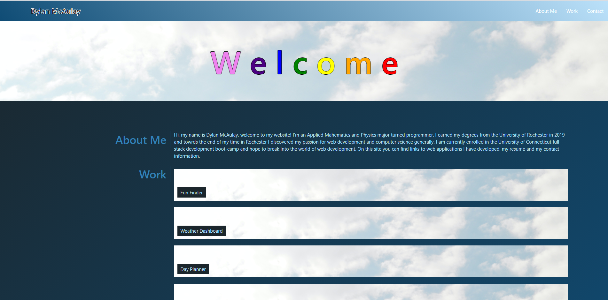

# Portfolio Page

# Description
This site is a personal porfolio page that is designed to display my web development skills and link to conact information and my other projects. The site features the use of materialize as a css framework and encorperates javascript and css animations. 
## Possable Improvements
The portfoli page is designed to beconinuisly updated as I add new skills to my web development repotoir, but there are some immediate changes that can be made. The screenshots of the apps display when the img is hoved over, bit since there is no hever in mobile they are not easily seen from a mobile device. An alternate method of displaying these needs to be devised or moblie. Additionally as screen width dereases the screenshot fails to fill the entire expanded app container; css solutions need to be found for this as well. The contact section could be iproved with icons and better formatiing.